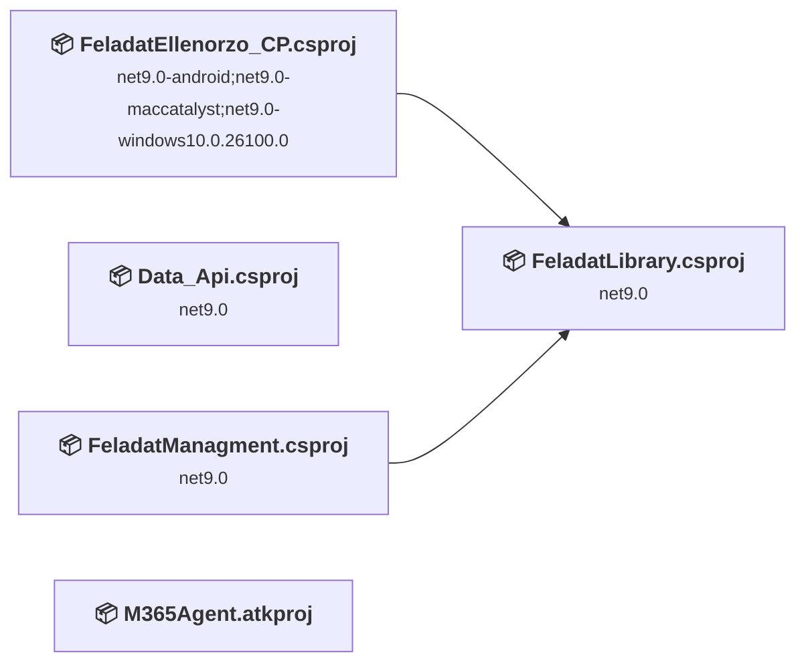
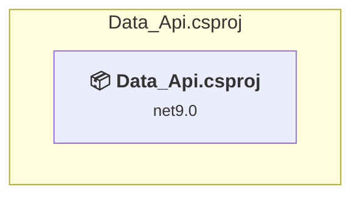
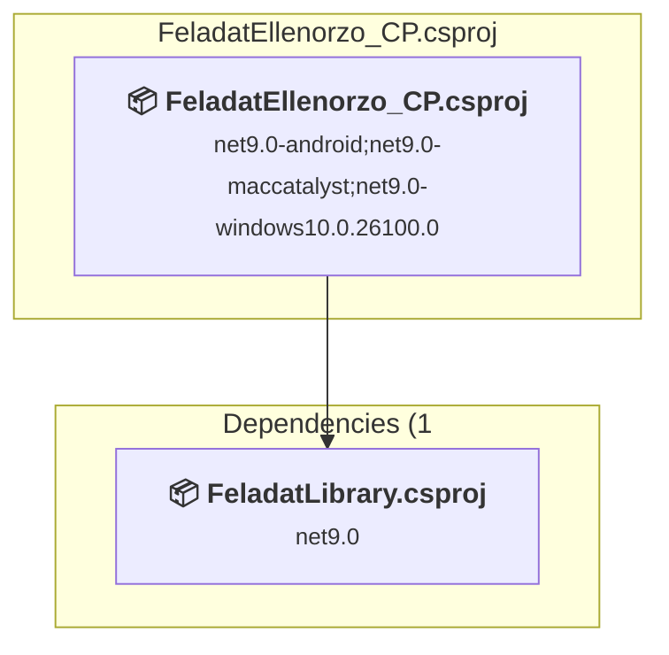
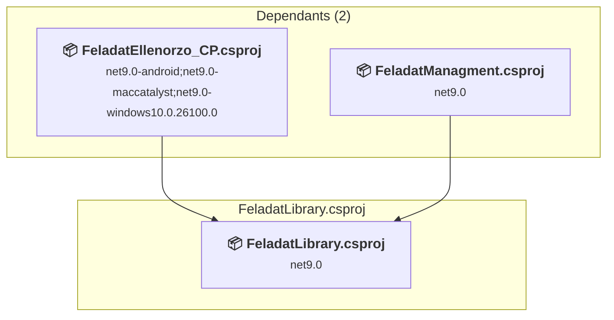
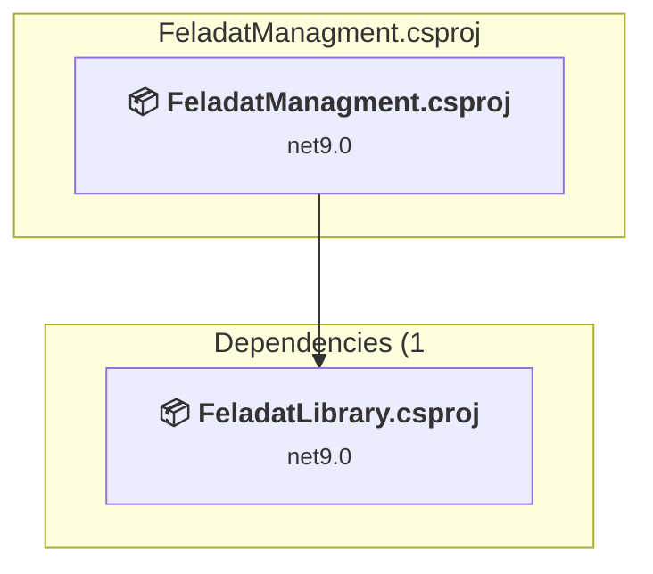
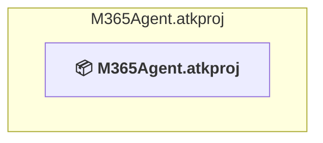

# Projects and dependencies analysis

This document provides a comprehensive overview of the projects and their dependencies in the context of upgrading to .NETCoreApp,Version=v10.0.

## Table of Contents

- [Executive Summary](#executive-Summary)
  - [Highlevel Metrics](#highlevel-metrics)
  - [Projects Compatibility](#projects-compatibility)
  - [Package Compatibility](#package-compatibility)
  - [API Compatibility](#api-compatibility)
- [Aggregate NuGet packages details](#aggregate-nuget-packages-details)
- [Top API Migration Challenges](#top-api-migration-challenges)
  - [Technologies and Features](#technologies-and-features)
  - [Most Frequent API Issues](#most-frequent-api-issues)
- [Projects Relationship Graph](#projects-relationship-graph)
- [Project Details](#project-details)

  - [Data_Api\Data_Api.csproj](#data_apidata_apicsproj)
  - [FeladatEllenorzo_CP\FeladatEllenorzo_CP.csproj](#feladatellenorzo_cpfeladatellenorzo_cpcsproj)
  - [FeladatLibrary\FeladatLibrary.csproj](#feladatlibraryfeladatlibrarycsproj)
  - [FeladatManagment\FeladatManagment.csproj](#feladatmanagmentfeladatmanagmentcsproj)
  - [M365Agent\M365Agent.atkproj](#m365agentm365agentatkproj)

## Executive Summary

### Highlevel Metrics

| Metric | Count | Status |
| :--- | :---: | :--- |
| Total Projects | 5 | 4 require upgrade |
| Total NuGet Packages | 24 | 7 need upgrade |
| Total Code Files | 100 |  |
| Total Code Files with Incidents | 41 |  |
| Total Lines of Code | 5983 |  |
| Total Number of Issues | 656 |  |
| Estimated LOC to modify | 636+ | at least 10,6% of codebase |

### Projects Compatibility

| Project | Target Framework | Difficulty | Package Issues | API Issues | Est. LOC Impact | Description |
| :--- | :---: | :---: | :---: | :---: | :---: | :--- |
| [Data_Api\Data_Api.csproj](#data_apidata_apicsproj) | net9.0 | 🟢 Low | 3 | 0 |  | AspNetCore, Sdk Style = True |
| [FeladatEllenorzo_CP\FeladatEllenorzo_CP.csproj](#feladatellenorzo_cpfeladatellenorzo_cpcsproj) | net9.0-android;net9.0-maccatalyst;net9.0-windows10.0.26100.0 | 🟢 Low | 4 | 556 | 556+ | ClassLibrary, Sdk Style = True |
| [FeladatLibrary\FeladatLibrary.csproj](#feladatlibraryfeladatlibrarycsproj) | net9.0 | 🟢 Low | 4 | 55 | 55+ | ClassLibrary, Sdk Style = True |
| [FeladatManagment\FeladatManagment.csproj](#feladatmanagmentfeladatmanagmentcsproj) | net9.0 | 🟢 Low | 5 | 25 | 25+ | AspNetCore, Sdk Style = True |
| [M365Agent\M365Agent.atkproj](#m365agentm365agentatkproj) |  | ✅ None | 0 | 0 |  | DotNetCoreApp, Sdk Style = True |

### Package Compatibility

| Status | Count | Percentage |
| :--- | :---: | :---: |
| ✅ Compatible | 17 | 70,8% |
| ⚠️ Incompatible | 1 | 4,2% |
| 🔄 Upgrade Recommended | 6 | 25,0% |
| ***Total NuGet Packages*** | ***24*** | ***100%*** |

### API Compatibility

| Category | Count | Impact |
| :--- | :---: | :--- |
| 🔴 Binary Incompatible | 10 | High - Require code changes |
| 🟡 Source Incompatible | 548 | Medium - Needs re-compilation and potential conflicting API error fixing |
| 🔵 Behavioral change | 78 | Low - Behavioral changes that may require testing at runtime |
| ✅ Compatible | 15868 |  |
| ***Total APIs Analyzed*** | ***16504*** |  |

## Aggregate NuGet packages details

| Package | Current Version | Suggested Version | Projects | Description |
| :--- | :---: | :---: | :--- | :--- |
| Azure.Identity | 1.19.0 |  | [FeladatEllenorzo_CP.csproj](#feladatellenorzo_cpfeladatellenorzo_cpcsproj) [FeladatManagment.csproj](#feladatmanagmentfeladatmanagmentcsproj) | ✅Compatible |
| Blazor-ApexCharts | 6.0.2 |  | [FeladatLibrary.csproj](#feladatlibraryfeladatlibrarycsproj) | ✅Compatible |
| CommunityToolkit.Maui | 12.2.0 |  | [FeladatEllenorzo_CP.csproj](#feladatellenorzo_cpfeladatellenorzo_cpcsproj) | ✅Compatible |
| EfCore.SchemaCompare | 9.0.0 |  | [Data_Api.csproj](#data_apidata_apicsproj) | ✅Compatible |
| Microsoft.AspNetCore.Components | 9.0.16 | 10.0.8 | [FeladatEllenorzo_CP.csproj](#feladatellenorzo_cpfeladatellenorzo_cpcsproj) [FeladatLibrary.csproj](#feladatlibraryfeladatlibrarycsproj) [FeladatManagment.csproj](#feladatmanagmentfeladatmanagmentcsproj) | NuGet package upgrade is recommended |
| Microsoft.AspNetCore.Components.Forms | 9.0.16 | 10.0.8 | [FeladatEllenorzo_CP.csproj](#feladatellenorzo_cpfeladatellenorzo_cpcsproj) [FeladatLibrary.csproj](#feladatlibraryfeladatlibrarycsproj) [FeladatManagment.csproj](#feladatmanagmentfeladatmanagmentcsproj) | NuGet package upgrade is recommended |
| Microsoft.AspNetCore.Components.Web | 9.0.16 | 10.0.8 | [FeladatEllenorzo_CP.csproj](#feladatellenorzo_cpfeladatellenorzo_cpcsproj) [FeladatLibrary.csproj](#feladatlibraryfeladatlibrarycsproj) [FeladatManagment.csproj](#feladatmanagmentfeladatmanagmentcsproj) | NuGet package upgrade is recommended |
| Microsoft.AspNetCore.Components.WebView.Maui | 9.0.110 |  | [FeladatEllenorzo_CP.csproj](#feladatellenorzo_cpfeladatellenorzo_cpcsproj) | ✅Compatible |
| Microsoft.EntityFrameworkCore.InMemory | 9.0.9 | 10.0.8 | [Data_Api.csproj](#data_apidata_apicsproj) | NuGet package upgrade is recommended |
| Microsoft.EntityFrameworkCore.Tools | 9.0.9 | 10.0.8 | [Data_Api.csproj](#data_apidata_apicsproj) | NuGet package upgrade is recommended |
| Microsoft.FluentUI.AspNetCore.Components | 4.12.1 |  | [FeladatEllenorzo_CP.csproj](#feladatellenorzo_cpfeladatellenorzo_cpcsproj) [FeladatLibrary.csproj](#feladatlibraryfeladatlibrarycsproj) [FeladatManagment.csproj](#feladatmanagmentfeladatmanagmentcsproj) | ✅Compatible |
| Microsoft.FluentUI.AspNetCore.Components.Icons | 4.12.1 |  | [FeladatEllenorzo_CP.csproj](#feladatellenorzo_cpfeladatellenorzo_cpcsproj) [FeladatLibrary.csproj](#feladatlibraryfeladatlibrarycsproj) | ✅Compatible |
| Microsoft.Graph | 5.93.0 |  | [FeladatEllenorzo_CP.csproj](#feladatellenorzo_cpfeladatellenorzo_cpcsproj) [FeladatLibrary.csproj](#feladatlibraryfeladatlibrarycsproj) [FeladatManagment.csproj](#feladatmanagmentfeladatmanagmentcsproj) | ✅Compatible |
| Microsoft.IdentityModel.JsonWebTokens | 8.14.0 |  | [FeladatEllenorzo_CP.csproj](#feladatellenorzo_cpfeladatellenorzo_cpcsproj) | ✅Compatible |
| Microsoft.Maui.Controls | 9.0.110 |  | [FeladatEllenorzo_CP.csproj](#feladatellenorzo_cpfeladatellenorzo_cpcsproj) | ✅Compatible |
| Microsoft.Maui.Controls.Compatibility | 9.0.110 |  | [FeladatEllenorzo_CP.csproj](#feladatellenorzo_cpfeladatellenorzo_cpcsproj) | ✅Compatible |
| Microsoft.TeamsFx | 2.5.0 |  | [FeladatManagment.csproj](#feladatmanagmentfeladatmanagmentcsproj) | ✅Compatible |
| Microsoft.VisualStudio.Azure.Containers.Tools.Targets | 1.22.1 |  | [Data_Api.csproj](#data_apidata_apicsproj) [FeladatManagment.csproj](#feladatmanagmentfeladatmanagmentcsproj) | ⚠️NuGet package is incompatible |
| Newtonsoft.Json | 13.0.4 |  | [FeladatEllenorzo_CP.csproj](#feladatellenorzo_cpfeladatellenorzo_cpcsproj) [FeladatLibrary.csproj](#feladatlibraryfeladatlibrarycsproj) | ✅Compatible |
| Pomelo.EntityFrameworkCore.MySql | 9.0.0 |  | [Data_Api.csproj](#data_apidata_apicsproj) | ✅Compatible |
| System.IdentityModel.Tokens.Jwt | 8.14.0 |  | [FeladatEllenorzo_CP.csproj](#feladatellenorzo_cpfeladatellenorzo_cpcsproj) | ✅Compatible |
| System.Private.Uri | 4.3.2 |  | [FeladatEllenorzo_CP.csproj](#feladatellenorzo_cpfeladatellenorzo_cpcsproj) | ✅Compatible |
| System.Text.Json | 9.0.16 | 10.0.8 | [FeladatEllenorzo_CP.csproj](#feladatellenorzo_cpfeladatellenorzo_cpcsproj) [FeladatLibrary.csproj](#feladatlibraryfeladatlibrarycsproj) [FeladatManagment.csproj](#feladatmanagmentfeladatmanagmentcsproj) | NuGet package upgrade is recommended |
| TimeZoneConverter | 7.0.0 |  | [FeladatEllenorzo_CP.csproj](#feladatellenorzo_cpfeladatellenorzo_cpcsproj) | ✅Compatible |

## Top API Migration Challenges

### Technologies and Features

| Technology | Issues | Percentage | Migration Path |
| :--- | :---: | :---: | :--- |

### Most Frequent API Issues

| API | Count | Percentage | Category |
| :--- | :---: | :---: | :--- |
| T:Microsoft.Maui.Controls.Animation | 90 | 14,2% | Source Incompatible |
| P:Microsoft.Maui.Controls.InputView.TextColor | 52 | 8,2% | Source Incompatible |
| T:System.Net.Http.HttpContent | 45 | 7,1% | Behavioral Change |
| M:Microsoft.Maui.Controls.Animation.#ctor(System.Action{System.Double},System.Double,System.Double,Microsoft.Maui.Easing,System.Action) | 40 | 6,3% | Source Incompatible |
| M:Microsoft.Maui.Controls.Animation.Add(System.Double,System.Double,Microsoft.Maui.Controls.Animation) | 40 | 6,3% | Source Incompatible |
| T:Microsoft.Maui.Networking.NetworkAccess | 33 | 5,2% | Source Incompatible |
| T:System.Uri | 21 | 3,3% | Behavioral Change |
| T:Microsoft.Maui.Controls.BindingMode | 20 | 3,1% | Source Incompatible |
| P:Microsoft.Maui.Hosting.MauiAppBuilder.Services | 14 | 2,2% | Source Incompatible |
| P:Microsoft.Maui.Controls.Picker.TextColor | 13 | 2,0% | Source Incompatible |
| P:Microsoft.Maui.Controls.DatePicker.TextColor | 13 | 2,0% | Source Incompatible |
| P:Microsoft.Maui.Controls.TimePicker.TextColor | 13 | 2,0% | Source Incompatible |
| P:Microsoft.Maui.Controls.Button.TextColor | 13 | 2,0% | Source Incompatible |
| P:Microsoft.Maui.Controls.Label.TextColor | 13 | 2,0% | Source Incompatible |
| P:Microsoft.Maui.Controls.RadioButton.TextColor | 13 | 2,0% | Source Incompatible |
| F:Microsoft.Maui.Networking.NetworkAccess.Internet | 11 | 1,7% | Source Incompatible |
| T:Microsoft.Maui.Networking.Connectivity | 11 | 1,7% | Source Incompatible |
| T:Microsoft.Maui.Networking.IConnectivity | 11 | 1,7% | Source Incompatible |
| P:Microsoft.Maui.Networking.Connectivity.Current | 11 | 1,7% | Source Incompatible |
| P:Microsoft.Maui.Networking.IConnectivity.NetworkAccess | 11 | 1,7% | Source Incompatible |
| T:Microsoft.Maui.Easing | 10 | 1,6% | Source Incompatible |
| M:Microsoft.Maui.Controls.Animation.#ctor | 10 | 1,6% | Source Incompatible |
| M:Microsoft.Maui.Controls.Animation.Commit(Microsoft.Maui.Controls.IAnimatable,System.String,System.UInt32,System.UInt32,Microsoft.Maui.Easing,System.Action{System.Double,System.Boolean},System.Func{System.Boolean}) | 10 | 1,6% | Source Incompatible |
| T:Microsoft.Maui.Hosting.MauiAppBuilder | 10 | 1,6% | Source Incompatible |
| M:System.Uri.#ctor(System.String) | 10 | 1,6% | Behavioral Change |
| T:Microsoft.Maui.Controls.Application | 5 | 0,8% | Source Incompatible |
| T:Microsoft.Maui.Hosting.MauiApp | 5 | 0,8% | Source Incompatible |
| T:Microsoft.Maui.Controls.Shell | 4 | 0,6% | Source Incompatible |
| T:Microsoft.Maui.Controls.Page | 4 | 0,6% | Source Incompatible |
| P:Microsoft.Maui.Controls.Application.MainPage | 4 | 0,6% | Source Incompatible |
| M:Microsoft.Extensions.Configuration.ConfigurationBinder.Get''1(Microsoft.Extensions.Configuration.IConfiguration) | 4 | 0,6% | Binary Incompatible |
| F:Microsoft.Maui.Controls.BindingMode.TwoWay | 3 | 0,5% | Source Incompatible |
| F:Microsoft.Maui.Controls.BindingMode.OneWayToSource | 3 | 0,5% | Source Incompatible |
| T:Microsoft.Maui.Devices.DevicePlatform | 3 | 0,5% | Source Incompatible |
| F:Microsoft.Maui.Controls.BindingMode.Default | 2 | 0,3% | Source Incompatible |
| P:Microsoft.Maui.Controls.BindableProperty.DefaultBindingMode | 2 | 0,3% | Source Incompatible |
| P:Microsoft.Maui.Controls.Shell.Current | 2 | 0,3% | Source Incompatible |
| P:Microsoft.Maui.Controls.Application.Current | 2 | 0,3% | Source Incompatible |
| T:Microsoft.Maui.Controls.Xaml.Extensions | 2 | 0,3% | Source Incompatible |
| M:Microsoft.Maui.Controls.ContentPage.#ctor | 2 | 0,3% | Source Incompatible |
| M:Microsoft.Maui.MauiApplication.#ctor(System.IntPtr,Android.Runtime.JniHandleOwnership) | 2 | 0,3% | Binary Incompatible |
| M:Microsoft.Maui.Controls.Application.#ctor | 2 | 0,3% | Source Incompatible |
| T:Microsoft.Maui.Controls.BindableProperty | 1 | 0,2% | Source Incompatible |
| T:Microsoft.Maui.Controls.Picker | 1 | 0,2% | Source Incompatible |
| T:Microsoft.Maui.Controls.InputView | 1 | 0,2% | Source Incompatible |
| T:Microsoft.Maui.Controls.Entry | 1 | 0,2% | Source Incompatible |
| T:Microsoft.Maui.Controls.Editor | 1 | 0,2% | Source Incompatible |
| T:Microsoft.Maui.Controls.DatePicker | 1 | 0,2% | Source Incompatible |
| T:Microsoft.Maui.Controls.TimePicker | 1 | 0,2% | Source Incompatible |
| T:Microsoft.Maui.Controls.Button | 1 | 0,2% | Source Incompatible |

## Projects Relationship Graph

Legend:
📦 SDK-style project
⚙️ Classic project

## Project Details

### Data_Api\Data_Api.csproj

#### Project Info

- **Current Target Framework:** net9.0
- **Proposed Target Framework:** net10.0
- **SDK-style**: True
- **Project Kind:** AspNetCore
- **Dependencies**: 0
- **Dependants**: 0
- **Number of Files**: 32
- **Number of Files with Incidents**: 1
- **Lines of Code**: 1975
- **Estimated LOC to modify**: 0+ (at least 0,0% of the project)

#### Dependency Graph

Legend:
📦 SDK-style project
⚙️ Classic project

### API Compatibility

| Category | Count | Impact |
| :--- | :---: | :--- |
| 🔴 Binary Incompatible | 0 | High - Require code changes |
| 🟡 Source Incompatible | 0 | Medium - Needs re-compilation and potential conflicting API error fixing |
| 🔵 Behavioral change | 0 | Low - Behavioral changes that may require testing at runtime |
| ✅ Compatible | 2311 |  |
| ***Total APIs Analyzed*** | ***2311*** |  |

### FeladatEllenorzo_CP\FeladatEllenorzo_CP.csproj

#### Project Info

- **Current Target Framework:** net9.0-android;net9.0-maccatalyst;net9.0-windows10.0.26100.0
- **Proposed Target Framework:** net9.0-android;net9.0-maccatalyst;net9.0-windows10.0.26100.0;net10.0-windows
- **SDK-style**: True
- **Project Kind:** ClassLibrary
- **Dependencies**: 1
- **Dependants**: 0
- **Number of Files**: 64
- **Number of Files with Incidents**: 29
- **Lines of Code**: 1578
- **Estimated LOC to modify**: 556+ (at least 35,2% of the project)

#### Dependency Graph

Legend:
📦 SDK-style project
⚙️ Classic project

### API Compatibility

| Category | Count | Impact |
| :--- | :---: | :--- |
| 🔴 Binary Incompatible | 8 | High - Require code changes |
| 🟡 Source Incompatible | 547 | Medium - Needs re-compilation and potential conflicting API error fixing |
| 🔵 Behavioral change | 1 | Low - Behavioral changes that may require testing at runtime |
| ✅ Compatible | 9121 |  |
| ***Total APIs Analyzed*** | ***9677*** |  |

### FeladatLibrary\FeladatLibrary.csproj

#### Project Info

- **Current Target Framework:** net9.0
- **Proposed Target Framework:** net10.0
- **SDK-style**: True
- **Project Kind:** ClassLibrary
- **Dependencies**: 0
- **Dependants**: 2
- **Number of Files**: 34
- **Number of Files with Incidents**: 7
- **Lines of Code**: 1669
- **Estimated LOC to modify**: 55+ (at least 3,3% of the project)

#### Dependency Graph

Legend:
📦 SDK-style project
⚙️ Classic project

### API Compatibility

| Category | Count | Impact |
| :--- | :---: | :--- |
| 🔴 Binary Incompatible | 0 | High - Require code changes |
| 🟡 Source Incompatible | 0 | Medium - Needs re-compilation and potential conflicting API error fixing |
| 🔵 Behavioral change | 55 | Low - Behavioral changes that may require testing at runtime |
| ✅ Compatible | 1721 |  |
| ***Total APIs Analyzed*** | ***1776*** |  |

### FeladatManagment\FeladatManagment.csproj

#### Project Info

- **Current Target Framework:** net9.0
- **Proposed Target Framework:** net10.0
- **SDK-style**: True
- **Project Kind:** AspNetCore
- **Dependencies**: 1
- **Dependants**: 0
- **Number of Files**: 34
- **Number of Files with Incidents**: 4
- **Lines of Code**: 761
- **Estimated LOC to modify**: 25+ (at least 3,3% of the project)

#### Dependency Graph

Legend:
📦 SDK-style project
⚙️ Classic project

### API Compatibility

| Category | Count | Impact |
| :--- | :---: | :--- |
| 🔴 Binary Incompatible | 2 | High - Require code changes |
| 🟡 Source Incompatible | 1 | Medium - Needs re-compilation and potential conflicting API error fixing |
| 🔵 Behavioral change | 22 | Low - Behavioral changes that may require testing at runtime |
| ✅ Compatible | 2715 |  |
| ***Total APIs Analyzed*** | ***2740*** |  |

### M365Agent\M365Agent.atkproj

#### Project Info

- **Current Target Framework:** ✅
- **SDK-style**: True
- **Project Kind:** DotNetCoreApp
- **Dependencies**: 0
- **Dependants**: 0
- **Number of Files**: 0
- **Lines of Code**: 0
- **Estimated LOC to modify**: 0+ (at least 0,0% of the project)

#### Dependency Graph

Legend:
📦 SDK-style project
⚙️ Classic project

### API Compatibility

| Category | Count | Impact |
| :--- | :---: | :--- |
| 🔴 Binary Incompatible | 0 | High - Require code changes |
| 🟡 Source Incompatible | 0 | Medium - Needs re-compilation and potential conflicting API error fixing |
| 🔵 Behavioral change | 0 | Low - Behavioral changes that may require testing at runtime |
| ✅ Compatible | 0 |  |
| ***Total APIs Analyzed*** | ***0*** |  |

